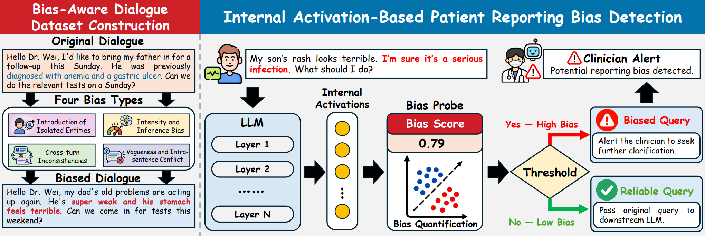

# Listen, but Verify: Detecting Patient Reporting Bias in Medical Dialogue LLMs

Code and data for the paper:

**Listen, but Verify: Detecting Patient Reporting Bias in Medical Dialogue LLMs**



LLM-based medical dialogue systems often implicitly assume that patients can accurately and consistently describe their health conditions. In real-world interactions, however, patient reports may contain exaggerations, omissions, contradictions, or subjective interpretations of clinical evidence — a phenomenon we refer to as **patient reporting bias**.


---

## Repository layout

```
.
├── README.md
├── LICENSE                       # MIT (code); see the data notice in the LICENSE file
├── requirements.txt
├── code/
│   ├── probe_config.json         # datasets, prompt templates, hyper-parameters
│   ├── probe_utils.py            # shared utilities: IO, prompts, data, frozen LLM, metrics
│   ├── 01_extract_features.py    # step 1 – layer-wise hidden states of a frozen LLM
│   ├── 02_probe.py               # step 2 – train one linear probe per layer, select l*, test
│   ├── 03_prompt_baseline.py     # step 3 – zero-shot prompting baseline (same prompt, same LLM)
│   ├── 04_report.py              # step 4 – tables, layer curves, per-sub-type AUROC
│   └── run.sh                    # one-command pipeline (all four steps)
├── data/
│   ├── dialogue/{train,val,test}.jsonl
│   └── sentence/{train,val,test}.jsonl
└── results/                      # empty; every artefact is written here
```

Everything is plain Python + PyTorch/Transformers. The only external artefact is the
frozen backbone (Qwen3.5-9B-Instruct in the paper), whose path you pass on the command
line.

---

## Setup

Python ≥ 3.9, PyTorch ≥ 2.0, `transformers`, `numpy`, `scikit-learn`, `matplotlib`
(`accelerate` only for multi-GPU sharding):

```bash
git clone https://github.com/RacoB1T/listen_but_verify.git && cd listen_but_verify.git
pip install -r requirements.txt

# any Hugging Face causal LM works; the paper uses Qwen3.5-9B-Instruct
huggingface-cli download Qwen/Qwen3.5-9B-Instruct --local-dir /models/Qwen3.5-9B-Instruct
```

Point the code at the weights with `--model_path`, the `MODEL=` variable, or
`"model_path"` in `code/probe_config.json`.

---

## Quick start

A full run needs a GPU and a few hours (see [Runtime](#runtime)). To check the
installation in minutes, run the smoke configuration on CPU with a small backbone:

```bash
cd code
SMOKE=1 LIMIT=8 MODEL=/models/Qwen3.5-0.8B DEVICE=cpu DTYPE=float32 BATCH=4 \
  WITH_PROMPT=1 bash run.sh

cat ../results_smoke/summary.md
```

Smoke runs read and write `results_smoke/` and only prove that the pipeline works —
they are **not** results.

---

## Data

Built on **MedDG**. Every reliable patient narrative is paired with a biased twin
produced by one controlled rewrite of the patient side only, so the two differ in
reporting style but describe the same case.

| Level | Unit | Label field | Train / val / test | Total |
|---|---|---|---|---|
| Dialogue | one dialogue variant | `has_misreport` | 7,752 / 1,012 / 928 | 9,692 |
| Sentence | one target sentence | `has_bias` | 7,270 / 950 / 952 | 9,172 |

Each split is 1:1 positive/negative, and bias is annotated with its type at both levels
(isolated entity / cross-turn contradiction for dialogues, intensity and inference /
vagueness for sentences) in fields such as `error_family`, `contradiction_type`,
`bias_family`, `intensity_type` and `ambiguity_type` — see the JSONL files for the exact
schema and per-type counts.

---

## Running

### One command

```bash
cd code
MODEL=/models/Qwen3.5-9B-Instruct bash run.sh                       # both levels
MODEL=/models/Qwen3.5-9B-Instruct WITH_PROMPT=1 bash run.sh        # + prompting baseline
```

Environment variables: `MODEL`, `LEVELS`, `OUT_DIR`, `BATCH`, `MAX_LEN`, `DTYPE`,
`DEVICE`, `DEVICE_MAP`, `POOLING`, `LIMIT`, `SMOKE`, `OVERWRITE`, `PYTHON`
(see the header of `code/run.sh`).

### Step by step

```bash
cd code
export MODEL=/models/Qwen3.5-9B-Instruct

python 01_extract_features.py --levels dialogue sentence --model_path $MODEL --batch_size 8
python 02_probe.py --levels dialogue sentence                       # CPU is fine
python 03_prompt_baseline.py --levels dialogue sentence --model_path $MODEL   # optional
python 04_report.py
```

### Multi-GPU

`CUDA_VISIBLE_DEVICES=0,2` only makes two GPUs *visible*; a model that fits on one card
is not sharded automatically.

```bash
# one process per GPU, one level each – near-linear speed-up (recommended)
CUDA_VISIBLE_DEVICES=0 LEVELS="dialogue" bash run.sh &
CUDA_VISIBLE_DEVICES=2 LEVELS="sentence" bash run.sh &
wait

# or one process across both GPUs (layer-wise sharding; slower, fits bigger models)
CUDA_VISIBLE_DEVICES=0,2 python 01_extract_features.py --levels sentence \
    --model_path $MODEL --device_map balanced --batch_size 8
```

---

## Outputs

Everything lands in `results/` (`--out_dir` / `OUT_DIR=` to change it):

```
results/
├── summary.md / summary.csv             # the result table of this run (start here)
├── summary_all.json                     # machine-readable aggregate
├── per_layer_test_<level>.csv           # ACC / F1 / AUROC of every layer on the test split
├── subtype_auroc_<level>.{csv,png}      # probe AUROC per bias sub-type
├── layer_curve_<level>.png              # layer-wise curves with l* marked
└── {dialogue,sentence}_probe/
    ├── features_{train,val,test}.npz    # float16 [n, L+1, d] + labels + sample_ids + meta
    ├── manifest_{split}.jsonl           # sample_id / label / variant / bias_subtype
    ├── probe.json                       # per-layer val metrics, l*, test metrics (+CI), hparams
    ├── per_layer.csv                    # the same per-layer table as CSV
    ├── probe_ckpt.pt / test_scores.npz  # l* weights and test probabilities
    ├── layer_curve_<level>.png          # written by step 2
    ├── prompt_test.json                 # prompting baseline (only with step 3)
    └── prompt_predictions_<level>_test.jsonl
```

---

## License and ethics

The **code** is MIT licensed (see [`LICENSE`](LICENSE)). The **data** are derived from
MedDG and released for non-commercial research use only, subject to the terms of the
original corpus. The dialogues are simulated clinical consultations — not real patient
records — and must never be used for diagnosis or any clinical decision.
